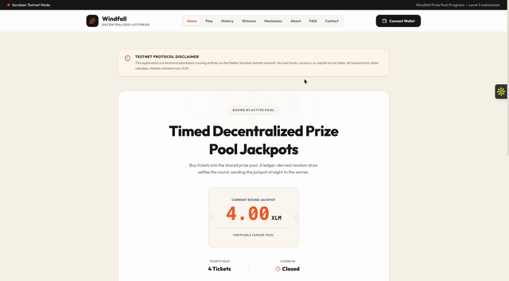
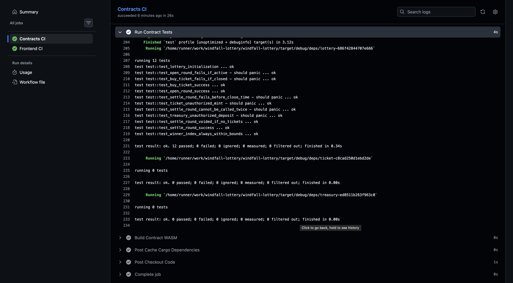
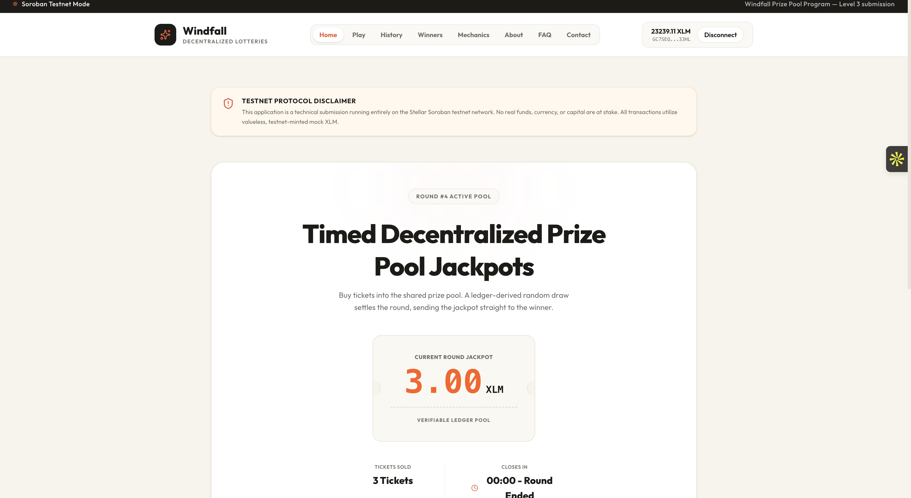
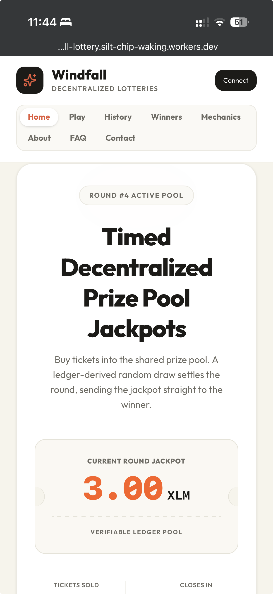
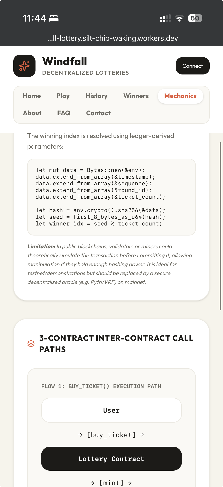

# Windfall — On-Chain Timed Prize Pools

[](https://github.com/shaurya-garg-82/windfall-lottery/actions/workflows/ci.yml)


Live Demo: https://windfall-lottery.silt-chip-waking.workers.dev
Demo Video (1–2 min): 

## Project Description

**Windfall** is a decentralized, timed round prize pool and lottery dApp built on the Stellar Soroban smart contract network. Users connect their browser wallets and purchase ticket tokens during active, timed pools. When the round timer expires, a ledger-derived random draw is triggered, distributing 95% of the accumulated jackpot directly to the winner's account and dispersing the remaining 5% fee to a secure Treasury contract vault.

> [!WARNING]
> **TESTNET DISCLAIMER:** This project is a technical demo operating exclusively on the Stellar Testnet. No real funds, currency, or real-world assets are utilized. All operations run using valueless testnet-minted mock XLM.

## Architecture

The system is composed of 3 distinct custom smart contracts orchestrating the prize pool lifecycle:

```
                  ┌──────────────────────────────┐
                  │          Lottery             │
                  │   (Coordinator Contract)     │
                  └──────┬────────────────┬──────┘
                         │                │
           (delegated)   │                │   (fee payout)
            mint calls   │                │    dispersal
                         ▼                ▼
                  ┌──────────────┐   ┌──────────────┐
                  │    Ticket    │   │  Treasury    │
                  │ (NFT Token)  │   │ (Fee Vault)  │
                  └──────────────┘   └──────────────┘
```

## Tech Stack

The application is built using the following stack:
* **Smart Contracts:** Rust, Soroban SDK v26
* **Frontend Web:** Next.js 16 (App Router, Turbopack), React
* **Styling & Theme:** Tailwind CSS, custom warm cream/paper "Carnival Ledger" color palette
* **Wallet Kit:** `@creit.tech/stellar-wallets-kit` (Freighter primary)
* **API Connection:** Soroban RPC, Horizon API

## Smart Contracts (Testnet)

All contract builds were compiled using Soroban SDK `v26` and deployed to the Stellar Testnet:

**Admin:** `GC7SEQUPZUQSFX4HZECHCF5CSD7VYUVXCDREQBHQVS5BLDCOESCD33HL` (authorizes `open_round` on the Lottery and `withdraw` on the Treasury).

| Contract | Address | Stellar Expert Link |
|---|---|---|
| **Lottery (Coordinator)** | `CBNZ3QUKPHTXQ45J5TMKHKZPXUH6IA5TGSYL42LZXBCUXZJ5JPM4MHFQ` | [Lottery Contract](https://stellar.expert/explorer/testnet/contract/CBNZ3QUKPHTXQ45J5TMKHKZPXUH6IA5TGSYL42LZXBCUXZJ5JPM4MHFQ) |
| **Ticket Token** | `CA5RC26Z4I5K7Y3BYVKTUTI5IJ2T73YSL4YT4ZIPNFZ344FHZK3G26KW` | [Ticket Contract](https://stellar.expert/explorer/testnet/contract/CA5RC26Z4I5K7Y3BYVKTUTI5IJ2T73YSL4YT4ZIPNFZ344FHZK3G26KW) |
| **Treasury Pool** | `CALL5JIM7PHWSYGFRVZ345JQSWQSBCKMWZ5TUIOS2BTPL4OG2HV3I7HA` | [Treasury Contract](https://stellar.expert/explorer/testnet/contract/CALL5JIM7PHWSYGFRVZ345JQSWQSBCKMWZ5TUIOS2BTPL4OG2HV3I7HA) |
| **Native XLM Wrapper** | `CDLZFC3SYJYDZT7K67VZ75HPJVIEUVNIXF47ZG2FB2RMQQVU2HHGCYSC` | [XLM SAC Wrapper](https://stellar.expert/explorer/testnet/contract/CDLZFC3SYJYDZT7K67VZ75HPJVIEUVNIXF47ZG2FB2RMQQVU2HHGCYSC) |

## Inter-Contract Calls

Contracts coordinate atomically on-chain using Soroban's native `env.invoke_contract` mechanism.

### Call Paths:
1. **`lottery.buy_ticket() -> ticket.mint(buyer, round_id)`**: When a user purchases a ticket, the coordinator contract locks the XLM price and invokes the Ticket contract to mint a unique ticket token to the buyer.
2. **`lottery.settle_round() -> native XLM SAC transfer to winner and -> treasury.deposit_fee()`**: Upon timer expiration, the coordinator draws the winner, sends the 95% payout, and invokes the Treasury contract to deposit the 5% fee.

### Verified Transaction Hash Proofs:
Contract initialization and execution on the current deployment (admin = `GC7SEQUPZUQSFX4HZECHCF5CSD7VYUVXCDREQBHQVS5BLDCOESCD33HL`):
* **Lottery `init`:** [`4e25b625d9d679dae493cf0816fc4552ec6bce003e849cba025cfc7fae78d20f`](https://stellar.expert/explorer/testnet/tx/4e25b625d9d679dae493cf0816fc4552ec6bce003e849cba025cfc7fae78d20f)
* **Ticket `init`:** [`c481f292d937547c4242ac636446f3438cddac0a6ee41de070737df3d06765dc`](https://stellar.expert/explorer/testnet/tx/c481f292d937547c4242ac636446f3438cddac0a6ee41de070737df3d06765dc)
* **Treasury `init`:** [`94f0c693e266871a8b5c20d1bee282d09896d44bf750598c82c4cfe50a1abac8`](https://stellar.expert/explorer/testnet/tx/94f0c693e266871a8b5c20d1bee282d09896d44bf750598c82c4cfe50a1abac8)
* **Open Round #1:** [`337ed831713d670c27f6a62c06026c4db059f880ac7f811f15711b98cc09cb78`](https://stellar.expert/explorer/testnet/tx/337ed831713d670c27f6a62c06026c4db059f880ac7f811f15711b98cc09cb78)
* **Approve XLM SAC:** [`4b0aa5f63c4031c66f58ea23e27af3b6f93335dbac5e8895d8bb15d827fa0ae0`](https://stellar.expert/explorer/testnet/tx/4b0aa5f63c4031c66f58ea23e27af3b6f93335dbac5e8895d8bb15d827fa0ae0)
* **Buy Ticket #1:** [`94536f8766cbadaf8df50ce9eb8367651e24fa16591f09b27f72118df7b5099c`](https://stellar.expert/explorer/testnet/tx/94536f8766cbadaf8df50ce9eb8367651e24fa16591f09b27f72118df7b5099c)
* **Settle Round (Atomic Dispersal inter-contract proof):** [`12d2570e4eaa4c62339e9602179ce8b00472b4b4eeffc9651b0125a266bee758`](https://stellar.expert/explorer/testnet/tx/12d2570e4eaa4c62339e9602179ce8b00472b4b4eeffc9651b0125a266bee758)


## Event Streaming & Real-Time Updates

Each contract emits Soroban events for its key actions, which are indexable off-chain:

| Contract | Event topic | Emitted by |
|---|---|---|
| Lottery | `round_opened`, `ticket_bought`, `round_settled`, `round_voided` | `open_round`, `buy_ticket`, `settle_round` |
| Treasury | `fee_deposited`, `fee_withdrawn` | `deposit_fee`, `withdraw` |

The frontend keeps the UI in sync in near-real-time **without a page reload** via a
silent polling loop in `WalletContext` (`refreshData(true)` every 10s), so the active
pot, ticket count, countdown and round status reflect on-chain activity (including
other players' purchases) as it happens. State is also refreshed immediately after
the connected user's own transactions confirm.

## Wallet Connection

Windfall integrates `@creit.tech/stellar-wallets-kit` to handle wallet handshakes:
* **Primary Extension:** Freighter browser wallet extension.
* **Fallback Modules:** Albedo and other kit-supported formats.
* **Session Persistence:** A global client-side React `WalletProvider` context holds connection state across routes, preventing page refresh credential loss.

## Core Mechanics

* **Ticket Price:** Set at exactly 1 XLM.
* **Pot Accumulation:** Each ticket purchased adds directly to the active round jackpot value.
* **Ledger-Derived Randomness:** Draw outcomes hash the ledger sequence number, timestamp, round ID, and total ticket count:
  `winner_index = u64(sha256(sequence + timestamp + round_id + ticket_count)) % ticket_count`
* **Jackpot Dispersal:** 95% paid to the winner, 5% dispersed to the fee treasury.

## Error Handling

We implement 3 critical client-side validation gates to capture and show errors prior to transaction submission:
1. **Insufficient XLM Balance:** Validates current wallet balance against the purchase cost, blocking the transaction with a warning.
2. **Expiration Draw Validation:** Blocks users from triggering `Settle` transactions until the round countdown timer reaches `00:00`.
3. **Double Open Restrictions:** Prevents administrative triggers to spin up new rounds while the current round status remains active.

## Screenshots

* **Wallet Connected:** 
* **Buy Flow:** 
* **Live Pot Counter:** 
* **Settled Round/Winner:** 
* **Mobile UI (375px):** 
* **CI/CD Run:** 
* **Cargo Test Output:** Captured directly in terminal logs (see Testing section below)


## Setup Instructions

### 1. Clone & Setup Workspace
```bash
git clone https://github.com/shaurya-garg-82/windfall-lottery.git
cd windfall-lottery
```

### 2. Contract Build & Test
```bash
# Build WASM binaries
stellar contract build

# Run unit tests
cargo test
```

### 2b. Deploy to Testnet (reproducible)
```bash
# Fund a deployer identity
stellar keys generate windfall-deployer --network testnet --fund

# Deploy the three contracts (native XLM SAC is the canonical testnet address below)
TICKET=$(stellar contract deploy --wasm target/wasm32v1-none/release/ticket.wasm   --source windfall-deployer --network testnet)
TREASURY=$(stellar contract deploy --wasm target/wasm32v1-none/release/treasury.wasm --source windfall-deployer --network testnet)
LOTTERY=$(stellar contract deploy --wasm target/wasm32v1-none/release/lottery.wasm  --source windfall-deployer --network testnet)
XLM=CDLZFC3SYJYDZT7K67VZ75HPJVIEUVNIXF47ZG2FB2RMQQVU2HHGCYSC
ADMIN=GC7SEQUPZUQSFX4HZECHCF5CSD7VYUVXCDREQBHQVS5BLDCOESCD33HL

# Initialize (order matters: ticket & treasury reference the lottery; init needs no admin signature)
stellar contract invoke --id $TICKET   --source windfall-deployer --network testnet -- init --lottery_contract $LOTTERY
stellar contract invoke --id $TREASURY --source windfall-deployer --network testnet -- init --admin $ADMIN --lottery_contract $LOTTERY --token $XLM
stellar contract invoke --id $LOTTERY  --source windfall-deployer --network testnet -- init --admin $ADMIN --ticket_contract $TICKET --treasury_contract $TREASURY --token $XLM --ticket_price 10000000 --fee_bps 500
```
Then set the three contract addresses in `frontend/.env.local` / `.env.production`.

### 3. Run Frontend Local Server
```bash
cd frontend
npm install
npm run dev
```

### 4. Build and Static Export
```bash
npm run build
```

## Testing

The smart contract suite maintains a fully-tested lifecycle verifying buy restrictions, auth constraints, duplicate blocks, and draw index limits.

### Captured Cargo Test Output:
```bash
$ cargo test
test test::test_lottery_initialization ... ok
test test::test_open_round_success ... ok
test test::test_ticket_unauthorized_mint - should panic ... ok
test test::test_buy_ticket_fails_if_closed - should panic ... ok
test test::test_open_round_fails_if_active - should panic ... ok
test test::test_treasury_unauthorized_deposit - should panic ... ok
test test::test_settle_round_fails_before_close_time - should panic ... ok
test test::test_buy_ticket_success ... ok
test test::test_settle_round_cannot_be_called_twice - should panic ... ok
test test::test_settle_round_voided_if_no_tickets ... ok
test test::test_settle_round_success ... ok
test test::test_winner_index_always_within_bounds ... ok

test result: ok. 12 passed; 0 failed; 0 ignored; 0 measured; 0 filtered out; finished in 0.40s
```

### Frontend Unit Tests

Pure client-side logic (XLM ⇄ stroop conversion in `frontend/src/utils/format.js`) is
covered by unit tests using Node's built-in test runner (no extra dependencies):

```bash
cd frontend
npm test
```

```bash
$ npm test
✔ toStroops converts whole XLM to stroops as BigInt
✔ toStroops handles fractional XLM and floors sub-stroop amounts
✔ fromStroops converts stroops back to an XLM string
✔ fromStroops returns '0' for falsy input
✔ toStroops and fromStroops round-trip for typical ticket prices
✔ STROOPS_PER_XLM matches the 7-decimal native asset precision
ℹ tests 6
ℹ pass 6
ℹ fail 0
```

## License

This project is licensed under the MIT License.
