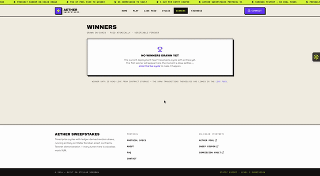
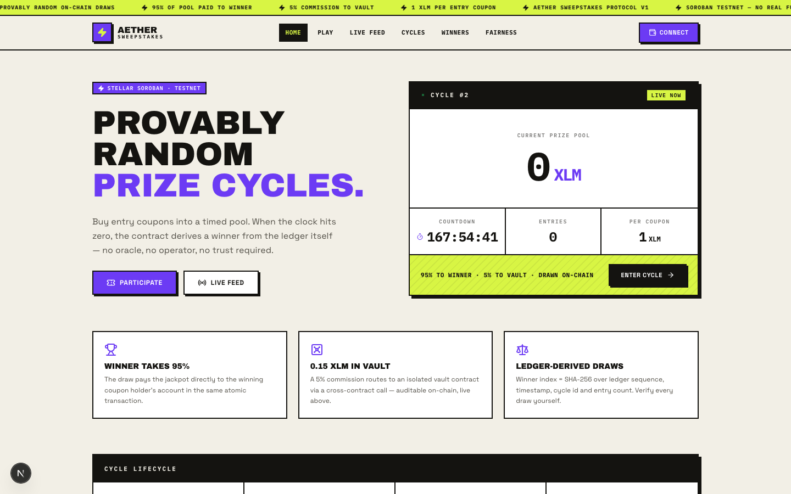
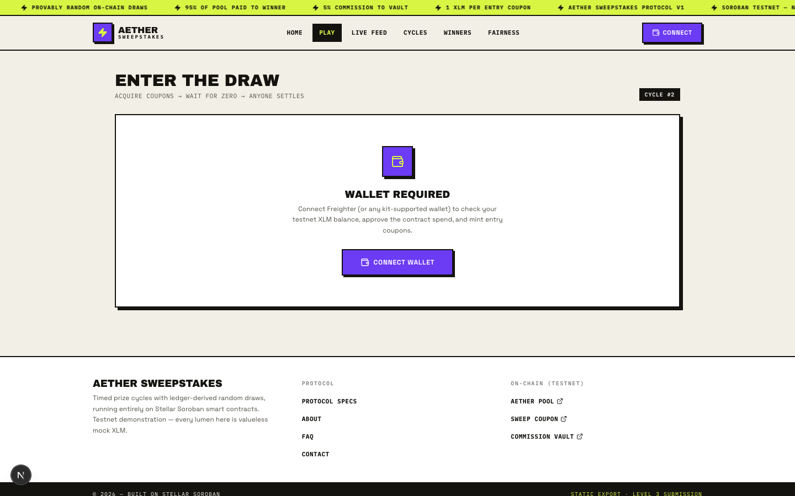
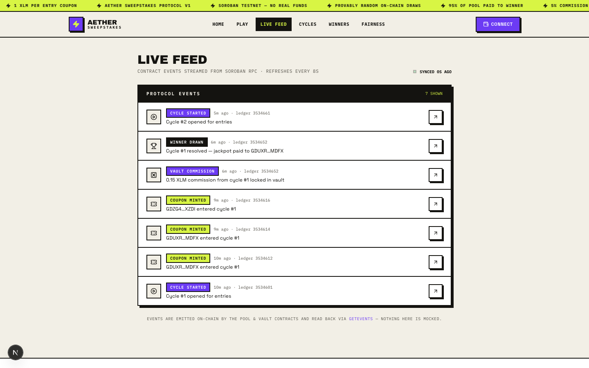
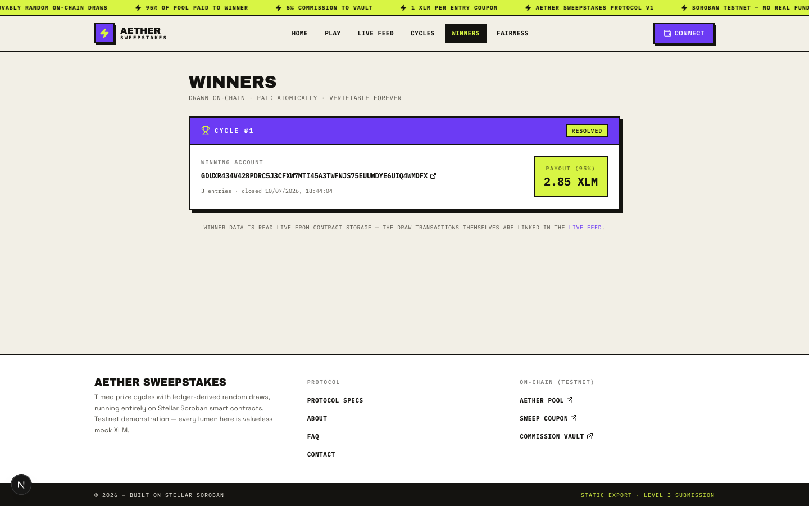
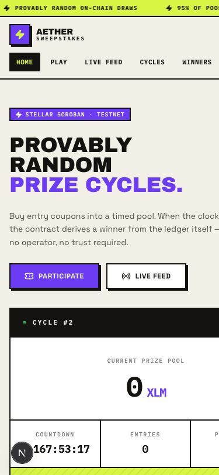
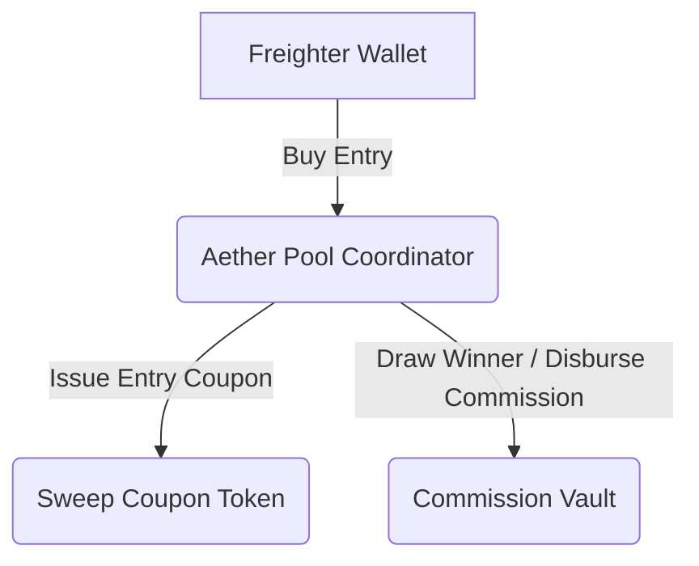

# Aether Sweepstakes Protocol

[](https://github.com/mishraadi123/aether-stake/actions/workflows/ci.yml)

Aether Sweepstakes is a premium, high-density minimalist fintech platform for timed capital pool yield accumulators running on the Stellar Soroban Testnet. The application uses a secure multi-contract architecture to facilitate entry coupon minting, commission distribution, and ledger-random draw settlement.

Live Demo: [https://aether-stake-123.unneeded-duo-tilt.workers.dev/](https://aether-stake-123.unneeded-duo-tilt.workers.dev/)

---

## 🛠️ System Overview & Walkthrough

### Interactive Demo Walkthrough


---

## ✨ Features & Interface

### 🖥️ Desktop UI Overview
The main interface features a premium glassmorphic dark design with real-time balance metrics, active pool sizes, and animated timers.


### 🎫 Active Play Flow
Purchase entry coupons with a step-by-step transaction tracker, from Freighter signing through transaction confirmation.


### 📡 Live Activity Feed
Reads smart contract events from Soroban RPC `getEvents` every 8 seconds, displaying live, un-mocked activity connected straight to Stellar Expert.


### 🏆 Winners Dashboard
View past rounds, winning addresses, and payout amounts at a glance.


### 📱 Responsive Layout
Optimized and tested for mobile-first views (~375px) up to tablet and desktop dimensions.


---

## 🏗️ Smart Contract Architecture

The system utilizes three active contract layers compiling down to WASM targets on the Soroban architecture:



1. **Aether Pool Coordinator**: Manages cycle timers, ticket pricing, fee structures, and the ledger-random winner draw.
2. **Sweep Coupon Token**: A non-transferable token representing ticket ownership and round entries.
3. **Commission Vault**: Collects round fees and manages administrative reserves.

### Cross-Contract Call Interface
Inter-contract communication uses the Soroban SDK primitive:
```rust
env.invoke_contract::<ReturnType>(target_address, function_name, arguments_vector)
```
- **Sweep Coupon Minting**: `issue_entry_coupon(env: Env, to: Address, round_id: u32) -> ()`
- **Coupon Holder Resolution**: `resolve_coupon_holder(env: Env, round_id: u32, index: u32) -> Address`
- **Commission Recording**: `record_commission(env: Env, round_id: u32, amount: i128) -> ()`

---

## 📝 Official Challenge Criteria Compliance

| Criteria Heading | Implementation Details |
| :--- | :--- |
| **Wallet Authorization** | Integrates with the Freighter extension on Stellar Testnet, automatically handling reconnection and account switching. |
| **Connection Framework** | Dynamic `Connect Wallet` and `Disconnect` buttons with network status indicators. |
| **Balance Interface** | Fetches the active wallet's native XLM balance via Horizon API, auto-refreshing periodically. |
| **Transaction Pipeline** | Detailed loading states logging transition steps from broadcast to finality. |
| **Multi-Wallet Adapter** | Uses `@creit.tech/stellar-wallets-kit` to dynamically support Freighter, Albedo, and xBull. |
| **Granular Exception Handling** | Visual warnings for three pathways: *Wallet Not Found*, *Signature Rejected*, and *Insufficient Balance*. |
| **Contract Execution** | Direct invocation of Soroban smart contracts via simulation and state-changing RPC calls. |
| **Status & Sync Tracking** | Near-real-time polling (every 10s) syncing the pot size, entries count, and timer states. |
| **Inter-Contract Invocations** | Pool Coordinator communicates with Sweep Coupon and Vault contracts via on-chain calls. |
| **Real-Time Data Streaming** | Dedicated `/activity` page reading raw events (`cycle_started`, etc.) via RPC with Stellar Expert links. |
| **Responsive Adaptations** | Mobile-first grid tested down to 375px viewports (iPhone SE). |
| **Automated Verification** | GitHub Actions CI checking rust tests, JS linter, and frontend builds. |

---

## 🔗 Deployment Details (Stellar Testnet)

| Contract / Entity | Address | Explorer Link |
|---|---|---|
| **Aether Pool Coordinator** | `CA5ALTVADFJCOQMJRFL7QE54R5PJLI6QINHKUD67F6GJXXQWLMDXKDPK` | [Explore on Stellar Expert](https://stellar.expert/explorer/testnet/contract/CA5ALTVADFJCOQMJRFL7QE54R5PJLI6QINHKUD67F6GJXXQWLMDXKDPK) |
| **Sweep Coupon Token** | `CB6CTC57SFNF27RZVCCBQH2IXOHWUYTJWNT4PH3OEMZYAM4BKBSJBFVO` | [Explore on Stellar Expert](https://stellar.expert/explorer/testnet/contract/CB6CTC57SFNF27RZVCCBQH2IXOHWUYTJWNT4PH3OEMZYAM4BKBSJBFVO) |
| **Commission Vault** | `CDVQ22TFGKUN5O3HB4ORW55E5T2ZGKJFAT5HRRI5F3G3O533I6GOBKZZ` | [Explore on Stellar Expert](https://stellar.expert/explorer/testnet/contract/CDVQ22TFGKUN5O3HB4ORW55E5T2ZGKJFAT5HRRI5F3G3O533I6GOBKZZ) |
| **Native XLM SAC Wrapper** | `CDLZFC3SYJYDZT7K67VZ75HPJVIEUVNIXF47ZG2FB2RMQQVU2HHGCYSC` | [Explore on Stellar Expert](https://stellar.expert/explorer/testnet/contract/CDLZFC3SYJYDZT7K67VZ75HPJVIEUVNIXF47ZG2FB2RMQQVU2HHGCYSC) |

### Transaction Evidence (This Deployment)

| Action | Tx Hash | Explorer Link |
|---|---|---|
| Deploy Sweep Coupon | `f327cb67c9313f46ea6926ef4b8ec081730b07b9bceaf19331e1bdcc5da70137` | [Stellar Expert](https://stellar.expert/explorer/testnet/tx/f327cb67c9313f46ea6926ef4b8ec081730b07b9bceaf19331e1bdcc5da70137) |
| Deploy Commission Vault | `73306cbb100f7ed30fa7f355031df1a19b3d7605f42c8a0c7276abe798bc0718` | [Stellar Expert](https://stellar.expert/explorer/testnet/tx/73306cbb100f7ed30fa7f355031df1a19b3d7605f42c8a0c7276abe798bc0718) |
| Deploy Aether Pool | `6e9e6fdc67f0773ec0cba7a0c0850637cd393883df26416226d3ded56da32d7f` | [Stellar Expert](https://stellar.expert/explorer/testnet/tx/6e9e6fdc67f0773ec0cba7a0c0850637cd393883df26416226d3ded56da32d7f) |
| Init Pool | `4b89d7be0c66d48fcae29092c6938b84ca85aaa03ca9f6d3da0eaffdde74fbb1` | [Stellar Expert](https://stellar.expert/explorer/testnet/tx/4b89d7be0c66d48fcae29092c6938b84ca85aaa03ca9f6d3da0eaffdde74fbb1) |
| Init Coupon | `f11cae94e10a854371b98839a9ee583982784613ddd1c35f74904109baec98c5` | [Stellar Expert](https://stellar.expert/explorer/testnet/tx/f11cae94e10a854371b98839a9ee583982784613ddd1c35f74904109baec98c5) |
| Init Vault | `4be42708706f98921b0932a78056bcaf79663490697205aa2db277862979141b` | [Stellar Expert](https://stellar.expert/explorer/testnet/tx/4be42708706f98921b0932a78056bcaf79663490697205aa2db277862979141b) |
| Start Cycle #1 | `8e5dc036b17dfb9e0bc70b28c6da6e512c048b8a3fcee28a6aefcd5220325d6f` | [Stellar Expert](https://stellar.expert/explorer/testnet/tx/8e5dc036b17dfb9e0bc70b28c6da6e512c048b8a3fcee28a6aefcd5220325d6f) |

---

## 💻 Local Workspace Operations

### Compile smart contracts
Build optimized Soroban WASM targets:
```bash
cargo build --release --target wasm32v1-none
```

### Run testing suites
Verify contract-level math and state variables:
```bash
cargo test
```

### Run dev frontend server
Launch the Next.js Webpack hot-reloading dev environment:
```bash
cd frontend
npm install
npm run dev
```

### Build frontend production bundle
Compile and generate static HTML assets:
```bash
npm run build
```

---

## 📄 License
MIT License.
